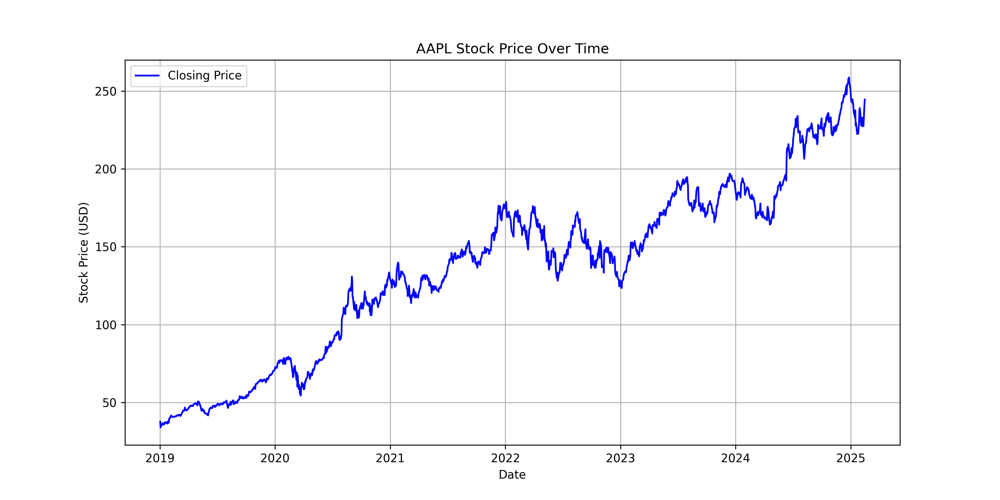
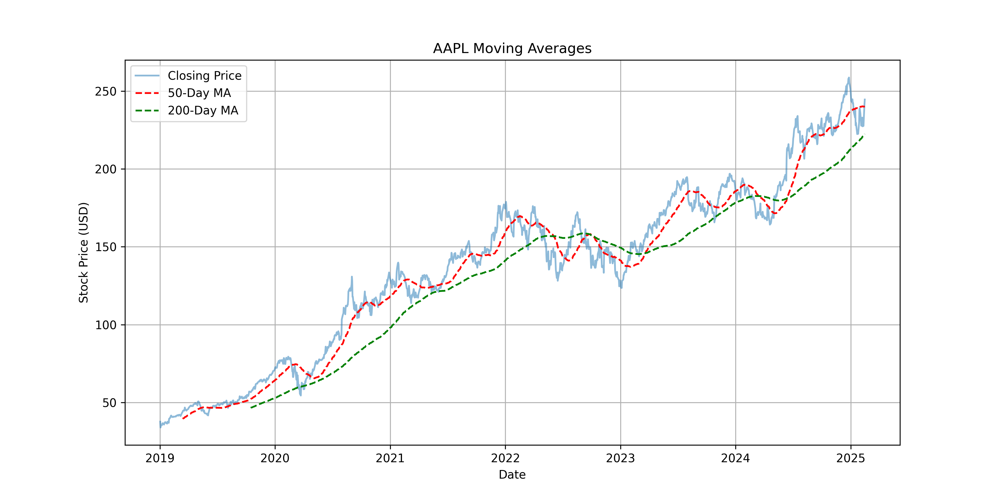
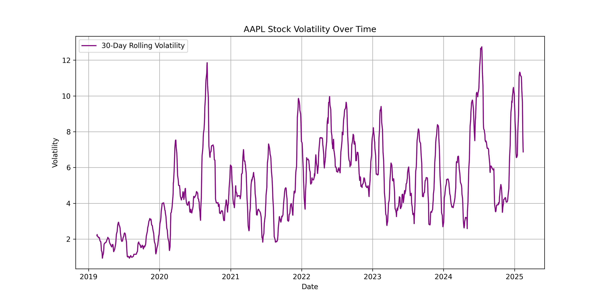
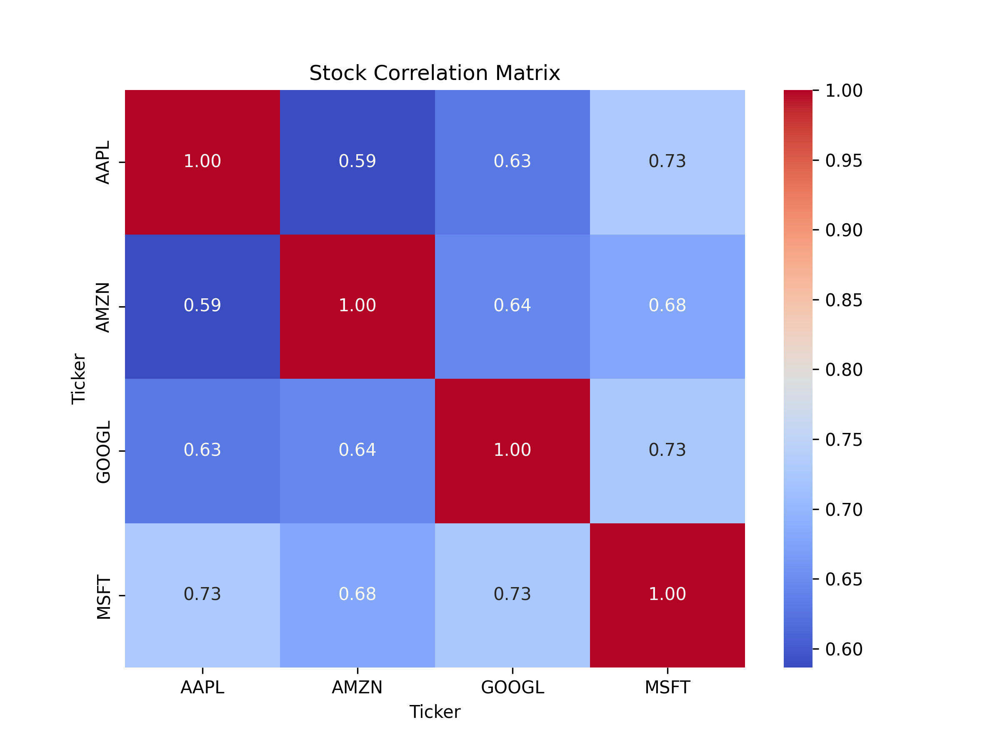
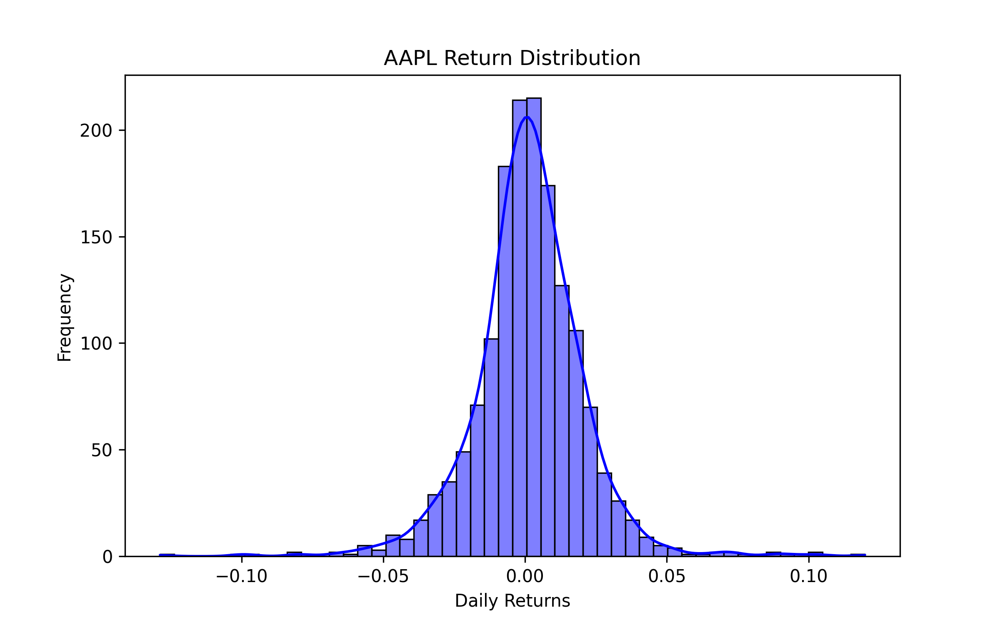

# 📈 Stock Market Analysis Using Python

## 🌟 Overview
This project performs stock market data analysis using Python and `yfinance`. It includes stock price trends, moving averages, volatility, correlation matrix, and return distribution.

## 📌 Key Insights
- **Stock Price Trends:** Visualizes stock price changes over time.
- **Moving Averages:** Identifies long-term and short-term trends.
- **Volatility Analysis:** Measures price fluctuations to assess risk.
- **Stock Correlation:** Understands relationships between multiple stocks.
- **Return Distribution:** Evaluates profitability and risk through daily returns.

## 📂 Files & Outputs
| Feature | File Name |
|---------|-----------|
| 📉 Stock Price Over Time | `stock_price_over_time.png` |
| 📊 Moving Averages | `moving_averages.png` |
| ⚡ Volatility Analysis | `stock_volatility.png` |
| 🔗 Stock Correlation Matrix | `correlation_matrix.png` |
| 🔄 Return Distribution | `return_distribution.png` |

## 📜 Visualizations & Insights
### 1️⃣ Stock Price Over Time
A visualization of the **closing stock price** over time.

📌 **Insight:** The price trend helps in identifying support and resistance levels.

### 2️⃣ Moving Averages
50-day and 200-day moving averages for trend analysis.

📌 **Insight:** The crossover of short and long-term MAs can indicate buy/sell signals.

### 3️⃣ Stock Volatility
30-day rolling standard deviation to analyze stock fluctuations.

📌 **Insight:** Higher volatility means greater risk; useful for risk management.

### 4️⃣ Stock Correlation Matrix
A heatmap showing how multiple stocks correlate with each other.

📌 **Insight:** Positive correlation suggests stocks move together, while negative correlation indicates inverse movements.

### 5️⃣ Stock Return Distribution
A histogram showing the distribution of daily returns.

📌 **Insight:** A wider distribution suggests high volatility, while a normal distribution is common for stable stocks.

## 🔧 Installation & Setup
To run this project, install the dependencies:
```bash
pip install pandas numpy yfinance matplotlib seaborn
```

## 🚀 Usage
Run the Jupyter Notebook to execute the analysis:
```bash
jupyter notebook stock_analysis.ipynb
```

## 🔥 Future Enhancements
- 📌 **LSTM-based** stock price prediction.
- 📌 Portfolio optimization using risk-adjusted returns.
- 📌 Real-time stock data integration for live tracking.

## 🤝 Contributing
Feel free to submit issues or pull requests to improve this project.

## 📜 License
This project is licensed under the **MIT License**.

